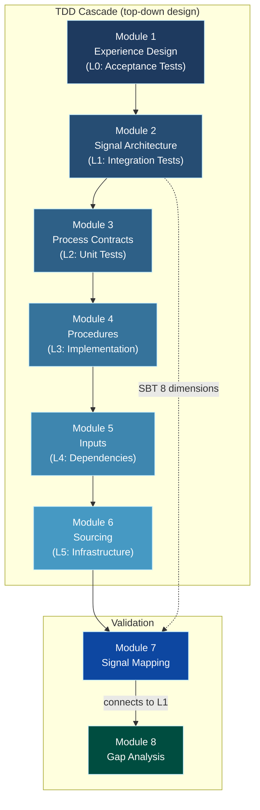

# Organizational Schema Theory — Prompt Toolkit

> Businesses are test suites. You are the architect.




## What Is This?

Organizational Schema Theory applies Test-Driven Development methodology to business design. Businesses are designed **backward** from desired customer experience through testable, version-controlled specifications where each operational layer validates the layer above it.

This toolkit is an 8-module AI prompt pipeline. Copy prompts into any capable LLM (Claude, GPT, Gemini) and produce a complete operational specification -- from customer experience goals down to sourcing requirements. No framework knowledge required to start.

## Quick Start

**Zero to complete business specification in 40 minutes:**

1. **Copy** the prompt from [`prompts/01_EXPERIENCE_DESIGN.md`](prompts/01_EXPERIENCE_DESIGN.md) into your LLM
2. **Describe** your business in plain language: "I run a neighborhood bakery. We want customers to feel welcomed, trust our ingredients, and leave with something they are proud to share."
3. **Get** structured YAML: experience contracts, signal requirements, process specifications
4. **Cascade** through Modules 2-6, pasting each output into the next prompt (~5 min each)
5. **Validate** with Module 8 -- the LLM identifies gaps, orphans, and conflicts
6. **Iterate** -- fix gaps by revisiting the relevant module

For common business types, start with a [starter pack](#industry-starter-packs) instead of describing from scratch.

For automated validation, feed YAML output into [`orgschema-validate`](https://github.com/spectralbranding/orgschema-framework).

## The 8 Modules

| # | Module | Grounded In | Input | Output |
|:--|:-------|:------------|:------|:-------|
| 1 | [Experience Design](prompts/01_EXPERIENCE_DESIGN.md) | Design Thinking, JTBD | Business description (plain language) | L0 experience contracts |
| 2 | [Signal Architecture](prompts/02_SIGNAL_ARCHITECTURE.md) | SBT 8 Dimensions | Module 1 output | L1 signal requirements |
| 3 | [Process Contracts](prompts/03_PROCESS_CONTRACTS.md) | SIPOC, ISO 9001 | Module 2 output | L2 process contracts |
| 4 | [Procedure Specification](prompts/04_PROCEDURE_SPECIFICATION.md) | Toyota Standardized Work | Module 3 output | L3 procedures |
| 5 | [Input Specification](prompts/05_INPUT_SPECIFICATION.md) | Bill of Materials, SCM | Module 4 output | L4 input specs |
| 6 | [Sourcing Requirements](prompts/06_SOURCING_REQUIREMENTS.md) | ISO 9001 clause 8.4 | Module 5 output | L5 sourcing requirements |
| 7 | [Signal Mapping](prompts/07_SIGNAL_MAPPING.md) | SBT Signal Decomposition | Modules 1-6 output | Operations-to-brand signal map |
| 8 | [Gap Analysis](prompts/08_GAP_ANALYSIS.md) | TDD, Lean Muda | All module outputs | Validation report |

Each module has a prompt in [`prompts/`](prompts/) and a YAML template in [`templates/`](templates/). See [`templates/FRAMEWORKS.md`](templates/FRAMEWORKS.md) for alternative framework citations per module.

## Industry Starter Packs

Pre-filled L0 experience contracts for common business types. Copy, modify, and feed into Module 2.

| Starter | Contracts | Types Included |
|:--------|:----------|:---------------|
| [Food Service](starters/food_service.yaml) | 12 | 5 experience, 4 constraint, 3 commitment |
| [Retail](starters/retail.yaml) | 11 | 6 experience, 3 constraint, 2 commitment |
| [SaaS (B2B)](starters/saas.yaml) | 10 | 5 experience, 3 constraint, 2 commitment |
| [Professional Services](starters/professional_services.yaml) | 9 | 5 experience, 2 constraint, 2 commitment |
| [Education](starters/education.yaml) | 10 | 6 experience, 2 constraint, 2 commitment |

## Executor Profiles

Procedures (Module 4) support three executor types in a single file:

| Profile | Description | When to Use |
|:--------|:------------|:------------|
| `human` (default) | Human operator following step-by-step procedures | Most businesses starting out |
| `hybrid` | Human with automated assistance (sensors, auto-dosing) | Scaling with quality control |
| `automated` | Fully automated system (IoT, robotics) | High-volume or precision-critical |

The active profile is selected by a single field: `active_executor: human`. Change it to `hybrid` or `automated` to switch. Module 8 (Gap Analysis) can compare profiles and flag signals that change when you switch executor types.

## Scope

This toolkit produces a complete operational specification: from customer experience goals (L0) through sourcing requirements (L5), with signal mapping and validation.

The following domains are adjacent but outside this toolkit's scope:

- Financial modeling (pricing, P&L, unit economics)
- Labor management (hiring, scheduling, compensation)
- Marketing and customer acquisition
- Legal and corporate structure
- Capital expenditure and facility planning

These domains interact with operational specifications -- a sourcing requirement has cost implications, a procedure has staffing implications -- but specifying them requires domain-specific frameworks beyond this toolkit's purpose. The operational specification produced here serves as structured input to those planning processes.

## Key Concepts

| Concept | Meaning |
|:--------|:--------|
| TDD cascade | Six-level test hierarchy: L0 acceptance tests through L5 infrastructure |
| Contract | What must be achieved (the test) -- executor-invariant |
| Procedure | How it is achieved (the implementation) -- executor-specific |
| Quality gate | Measurable parameter with min/max/target that a process must satisfy |
| Forkability | Copy the test suite, rewrite the implementation for your context |
| Schema vs Data | Schema (what to measure) is publishable; Data (values) is competitive moat |
| Backward traceability | Every parameter traces to the L0 contract it serves |

See [`docs/GLOSSARY.md`](docs/GLOSSARY.md) for the complete terminology reference.

## Repository Structure

```
orgschema-toolkit/
├── prompts/                    8 LLM-ready module prompts
│   ├── 01_EXPERIENCE_DESIGN.md
│   ├── 02_SIGNAL_ARCHITECTURE.md
│   ├── 03_PROCESS_CONTRACTS.md
│   ├── 04_PROCEDURE_SPECIFICATION.md
│   ├── 05_INPUT_SPECIFICATION.md
│   ├── 06_SOURCING_REQUIREMENTS.md
│   ├── 07_SIGNAL_MAPPING.md
│   ├── 08_GAP_ANALYSIS.md
│   └── README.md
├── templates/                  YAML output schemas (one per module)
│   ├── 01_experience_contracts.yaml
│   ├── 02_signal_requirements.yaml
│   ├── 03_process_contracts.yaml
│   ├── 04_procedures.yaml
│   ├── 05_input_specifications.yaml
│   ├── 06_sourcing_requirements.yaml
│   ├── 07_signal_map.yaml
│   ├── 08_validation_report.yaml
│   └── FRAMEWORKS.md
├── starters/                   Industry starter packs
│   ├── food_service.yaml
│   ├── retail.yaml
│   ├── saas.yaml
│   ├── professional_services.yaml
│   └── education.yaml
├── docs/
│   ├── METHODOLOGY.md
│   └── GLOSSARY.md
├── CITATION.cff
├── LICENSE
└── README.md
```

## Related Projects

| Project | Description |
|:--------|:------------|
| [orgschema-framework](https://github.com/spectralbranding/orgschema-framework) | Python validator + JSON Schema (`orgschema-validate` CLI) |
| [orgschema-demo](https://github.com/spectralbranding/orgschema-demo) | Spectra Coffee reference implementation (25 YAML files, CI/CD) |
| [sbt-framework](https://github.com/spectralbranding/sbt-framework) | Spectral Brand Theory toolkit (brand perception analysis) |

## Citation

```bibtex
@article{zharnikov2026ost,
  author  = {Zharnikov, Dmitry},
  title   = {The Organizational Schema Theory: Test-Driven Business Design},
  year    = {2026},
  journal = {SSRN Working Paper},
  url     = {https://papers.ssrn.com/sol3/papers.cfm?abstract_id=6323456}
}
```

## Author

**Dmitry Zharnikov** -- [spectralbranding.com](https://spectralbranding.com) | [orgschema.com](https://orgschema.com)

## License

MIT -- see [LICENSE](LICENSE).
